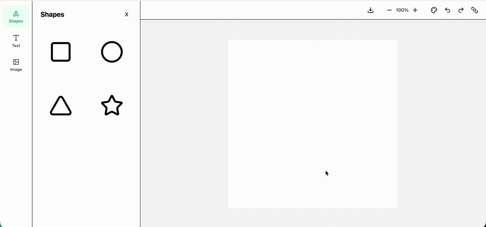

# Design Tool

Browser-based design editor built with React, TypeScript, Zustand, and Konva.

Users can create and edit shapes, text, and images, manage layer order, zoom the canvas, and export designs as PNG.

React / TypeScript / Zustand / React Konva / Tailwind CSS

---



## How I Designed the Editor

I wanted editor features to build on top of the same state model rather than introducing separate state for each interaction.

Selection, transformation, layer ordering, text editing, undo/redo, and persistence all operate on the same element state managed by Zustand.

This follows a unidirectional data flow where editor actions update state, and the canvas reflects the current state.

When refactoring, I focused on separating components by responsibility so it is easy to understand what each component does at a glance.

## Challenges I Faced

### Text Editing

Konva is great for rendering text, but not for editing it.

To support text editing, I render text on the canvas and switch to an HTML textarea overlay while editing.

```txt
Canvas Text
→ Double Click
→ HTML Textarea Overlay
→ State Update
→ Canvas Re-render
```

### Image Loading

Images load asynchronously, so transformers cannot always be attached immediately after rendering.

To solve this, image nodes are registered when loading completes and transformers are attached once the image becomes available.

### Undo / Redo

Undo and redo are implemented through editor state snapshots.

Because editor behaviors operate on the same element state, history restoration automatically updates rendering, transformations, layer ordering, and content through the same state model.

## Run

```bash
npm install
npm run dev
```
